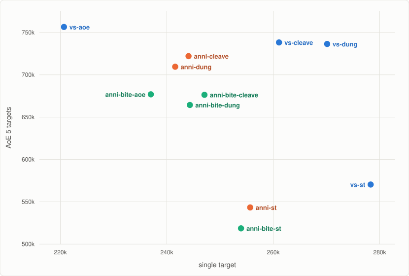

Devourer Demon Hunter, Midnight 12.1.5 PTR.

`devourer.simc` carries Void-Scarred and Annihilator gear and single-target talents; Void-Scarred is live and the rest is commented out below it.
Simmed at target_error 0.05.

## ST: 1 target, 300s, lust ([report](https://mimiron.raidbots.com/simbot/report/taZC6gL471MebLUTWWWchY))

| Build | DPS | Build report |
|---|---|---|
| vs-st | 278,302 | [report](https://mimiron.raidbots.com/simbot/report/seHXGefAEsTSRMcMzTxj22) |
| vs-dung | 270,122 | [report](https://mimiron.raidbots.com/simbot/report/tQ7cd7KdZWkxRj4DbHYckw) |
| vs-cleave | 261,076 | [report](https://mimiron.raidbots.com/simbot/report/nUuyPU3bc1ujnHEJVgGqtF) |
| anni-st | 255,663 | [report](https://mimiron.raidbots.com/simbot/report/qwyodQUfSYjVEjxUL1i2TE) |
| anni-bite-st | 253,940 | [report](https://mimiron.raidbots.com/simbot/report/e1t4oEcaLV5Pxe2WP9sbTg) |
| anni-bite-cleave | 247,071 | [report](https://mimiron.raidbots.com/simbot/report/aenqqbo7aCczvvay2254Tf) |
| anni-bite-dung | 244,329 | [report](https://mimiron.raidbots.com/simbot/report/kYgBpEkAVWajyoDDs9SzbG) |
| anni-cleave | 244,082 | [report](https://mimiron.raidbots.com/simbot/report/icrvQD74Mvam5uy9CDkWHC) |
| anni-dung | 241,576 | [report](https://mimiron.raidbots.com/simbot/report/4H3rzUQvZNhM1MvfrTQety) |
| anni-bite-aoe | 236,996 | [report](https://mimiron.raidbots.com/simbot/report/1XPJsbVbEoFaFL8CLMKzg9) |
| vs-aoe | 220,674 | [report](https://mimiron.raidbots.com/simbot/report/tx7RstmuUrb2ety3GF7F7C) |

## Cleave: 3 targets, 300s, lust ([report](https://mimiron.raidbots.com/simbot/report/g5ELQZFxwWbLsbYTT1PrEa))

| Build | DPS | Build report |
|---|---|---|
| vs-cleave | 540,354 | [report](https://mimiron.raidbots.com/simbot/report/nUuyPU3bc1ujnHEJVgGqtF) |
| vs-dung | 536,869 | [report](https://mimiron.raidbots.com/simbot/report/tQ7cd7KdZWkxRj4DbHYckw) |
| anni-cleave | 524,379 | [report](https://mimiron.raidbots.com/simbot/report/icrvQD74Mvam5uy9CDkWHC) |
| anni-dung | 515,993 | [report](https://mimiron.raidbots.com/simbot/report/4H3rzUQvZNhM1MvfrTQety) |
| anni-bite-cleave | 496,984 | [report](https://mimiron.raidbots.com/simbot/report/aenqqbo7aCczvvay2254Tf) |
| anni-bite-dung | 489,507 | [report](https://mimiron.raidbots.com/simbot/report/kYgBpEkAVWajyoDDs9SzbG) |
| vs-aoe | 483,834 | [report](https://mimiron.raidbots.com/simbot/report/tx7RstmuUrb2ety3GF7F7C) |
| vs-st | 457,701 | [report](https://mimiron.raidbots.com/simbot/report/seHXGefAEsTSRMcMzTxj22) |
| anni-bite-aoe | 454,126 | [report](https://mimiron.raidbots.com/simbot/report/1XPJsbVbEoFaFL8CLMKzg9) |
| anni-st | 433,604 | [report](https://mimiron.raidbots.com/simbot/report/qwyodQUfSYjVEjxUL1i2TE) |
| anni-bite-st | 417,925 | [report](https://mimiron.raidbots.com/simbot/report/e1t4oEcaLV5Pxe2WP9sbTg) |

## AoE: 5 targets, 300s, lust ([report](https://mimiron.raidbots.com/simbot/report/fXfp5tYirbLbBD2EH8pz1s))

| Build | DPS | Build report |
|---|---|---|
| vs-aoe | 756,569 | [report](https://mimiron.raidbots.com/simbot/report/tx7RstmuUrb2ety3GF7F7C) |
| vs-cleave | 738,296 | [report](https://mimiron.raidbots.com/simbot/report/nUuyPU3bc1ujnHEJVgGqtF) |
| vs-dung | 736,492 | [report](https://mimiron.raidbots.com/simbot/report/tQ7cd7KdZWkxRj4DbHYckw) |
| anni-cleave | 722,084 | [report](https://mimiron.raidbots.com/simbot/report/icrvQD74Mvam5uy9CDkWHC) |
| anni-dung | 709,577 | [report](https://mimiron.raidbots.com/simbot/report/4H3rzUQvZNhM1MvfrTQety) |
| anni-bite-aoe | 676,996 | [report](https://mimiron.raidbots.com/simbot/report/1XPJsbVbEoFaFL8CLMKzg9) |
| anni-bite-cleave | 676,388 | [report](https://mimiron.raidbots.com/simbot/report/aenqqbo7aCczvvay2254Tf) |
| anni-bite-dung | 664,414 | [report](https://mimiron.raidbots.com/simbot/report/kYgBpEkAVWajyoDDs9SzbG) |
| vs-st | 570,397 | [report](https://mimiron.raidbots.com/simbot/report/seHXGefAEsTSRMcMzTxj22) |
| anni-st | 543,317 | [report](https://mimiron.raidbots.com/simbot/report/qwyodQUfSYjVEjxUL1i2TE) |
| anni-bite-st | 518,653 | [report](https://mimiron.raidbots.com/simbot/report/e1t4oEcaLV5Pxe2WP9sbTg) |

## Dungeon: Temple of Sethraliss route, +20 keystone ([report](https://mimiron.raidbots.com/simbot/report/5Xs9dCA3nFyqksxTSYoNgK))

`temple-of-sethraliss-route.simc` walks a Temple of Sethraliss M+ route end to end. The pulls,
the chaining and the mob health all come off 12.1 PTR logs, scaled down to one actor, with health
at a +20 keystone. Run it with:

    simc devourer.simc temple-of-sethraliss-route.simc

| Build | DPS | Build report |
|---|---|---|
| vs-dung | 611,004 | [report](https://mimiron.raidbots.com/simbot/report/tQ7cd7KdZWkxRj4DbHYckw) |
| vs-cleave | 608,484 | [report](https://mimiron.raidbots.com/simbot/report/nUuyPU3bc1ujnHEJVgGqtF) |
| anni-dung | 605,047 | [report](https://mimiron.raidbots.com/simbot/report/4H3rzUQvZNhM1MvfrTQety) |
| anni-cleave | 597,096 | [report](https://mimiron.raidbots.com/simbot/report/icrvQD74Mvam5uy9CDkWHC) |
| anni-bite-dung | 589,118 | [report](https://mimiron.raidbots.com/simbot/report/kYgBpEkAVWajyoDDs9SzbG) |
| anni-bite-cleave | 582,207 | [report](https://mimiron.raidbots.com/simbot/report/aenqqbo7aCczvvay2254Tf) |
| vs-aoe | 575,848 | [report](https://mimiron.raidbots.com/simbot/report/tx7RstmuUrb2ety3GF7F7C) |
| anni-bite-aoe | 564,759 | [report](https://mimiron.raidbots.com/simbot/report/1XPJsbVbEoFaFL8CLMKzg9) |
| vs-st | 533,995 | [report](https://mimiron.raidbots.com/simbot/report/seHXGefAEsTSRMcMzTxj22) |
| anni-st | 527,214 | [report](https://mimiron.raidbots.com/simbot/report/qwyodQUfSYjVEjxUL1i2TE) |
| anni-bite-st | 510,541 | [report](https://mimiron.raidbots.com/simbot/report/e1t4oEcaLV5Pxe2WP9sbTg) |

## Talent strings

| Build | Talent string | Report |
|---|---|---|
| vs-st | `CgcBAAAAAAAAAAAAAAAAAAAAAAAWMzMzMzMzMwMAAAAAAALzYMYGAAAAAAAAmxMMmZmZYmZYmlZGjNttAgAGAjZmZbmZa2mZbmhxMGA` | [report](https://mimiron.raidbots.com/simbot/report/seHXGefAEsTSRMcMzTxj22) |
| vs-cleave | `CgcBAAAAAAAAAAAAAAAAAAAAAAAWMzMzMzMzMwMAAAAAAALzYMYGAAAAAAAAmxMMmZmZGzMDzsMDjNtsAgAGAjZmZZmZa2mZbmZwMGA` | [report](https://mimiron.raidbots.com/simbot/report/nUuyPU3bc1ujnHEJVgGqtF) |
| vs-aoe | `CgcBAAAAAAAAAAAAAAAAAAAAAAAWMzMzMzMzMwMAAAAAAALzYMYGAAAAAAAAmxMMzMzMzYmBzsMzYsplFAEwAMMzMLzMTz2MbGGGzA` | [report](https://mimiron.raidbots.com/simbot/report/tx7RstmuUrb2ety3GF7F7C) |
| vs-dung | `CgcBAAAAAAAAAAAAAAAAAAAAAAAWMzMzMzMzMwMAAAAAAALzYMYGAAAAAAAAmxMMmZmZGzMDzsMzYsplFAEwAYMzMLzMTz2MbmZMmxA` | [report](https://mimiron.raidbots.com/simbot/report/tQ7cd7KdZWkxRj4DbHYckw) |
| anni-st | `CgcBAAAAAAAAAAAAAAAAAAAAAAA2MmZmZmZmBzMAAAAAAALzYAzAAAAAAAAwMGMzMzMjZmZGzsYGjFtswMzMzWbzMzAYmZAIwDMGMMA` | [report](https://mimiron.raidbots.com/simbot/report/qwyodQUfSYjVEjxUL1i2TE) |
| anni-cleave | `CgcBAAAAAAAAAAAAAAAAAAAAAAA2MmZmZmZmBzMAAAAAAALzYAzAAAAAAAAwMGMzMzMzMzMDzsYGjFZhZmZmt2mZmBwYGAC8AjZYMD` | [report](https://mimiron.raidbots.com/simbot/report/icrvQD74Mvam5uy9CDkWHC) |
| anni-dung | `CgcBAAAAAAAAAAAAAAAAAAAAAAA2MmZmZmZmBzMAAAAAAALzYAzAAAAAAAAwMGMzMzMzMzMDzsYGjFZhZmZmtWmZmBwYGAC8AjZYMD` | [report](https://mimiron.raidbots.com/simbot/report/4H3rzUQvZNhM1MvfrTQety) |
| anni-bite-st | `CgcBAAAAAAAAAAAAAAAAAAAAAAA2MmZmZmZmBzMAAAAAAALzYAzAAAAAAAAwMGMmZmZMzMzYmFzYsolFmZmZ2abmZGAzMDABmZgZMA` | [report](https://mimiron.raidbots.com/simbot/report/e1t4oEcaLV5Pxe2WP9sbTg) |
| anni-bite-cleave | `CgcBAAAAAAAAAAAAAAAAAAAAAAA2MmZmZmZmBzMAAAAAAALzYAzAAAAAAAAwMGMPwMzMzMzMDzsYGjFZhZmZmt2mZmBwYGACMzMYGD` | [report](https://mimiron.raidbots.com/simbot/report/aenqqbo7aCczvvay2254Tf) |
| anni-bite-aoe | `CgcBAAAAAAAAAAAAAAAAAAAAAAA2MmZmZmZmBzMAAAAAAALzYAzAAAAAAAAwMGMzMzMzMzMYmFzYsolFmZmZ2abmZGAjZAIwMDMjB` | [report](https://mimiron.raidbots.com/simbot/report/1XPJsbVbEoFaFL8CLMKzg9) |
| anni-bite-dung | `CgcBAAAAAAAAAAAAAAAAAAAAAAA2MmZmZmZmBzMAAAAAAALzYAzAAAAAAAAwMGMPwMzMzMzMDzsYGjFZhZmZmtWmZmBwYGACMzMYGD` | [report](https://mimiron.raidbots.com/simbot/report/kYgBpEkAVWajyoDDs9SzbG) |

## Contributing

PRs welcome! If you beat one of these numbers include the profile changes and a Raidbots report at target_error 0.05.
