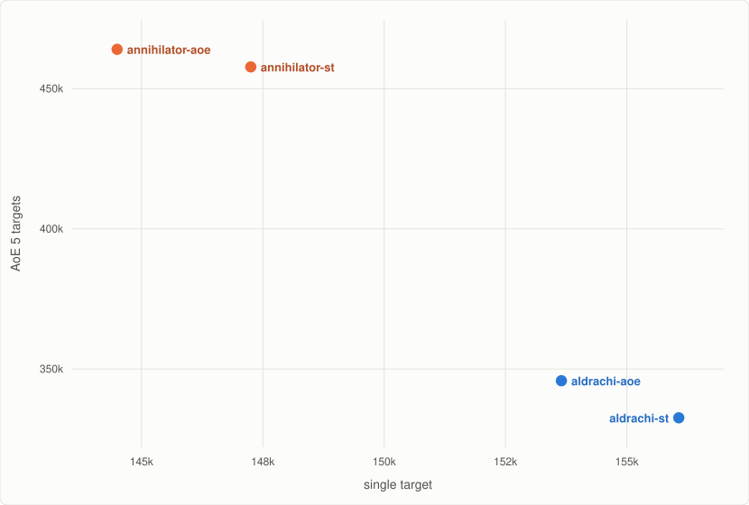

Vengeance Demon Hunter, Midnight 12.1.5 PTR.

`vengeance.simc` carries Aldrachi Reaver and Annihilator gear and single-target talents; Aldrachi Reaver is live and the rest is commented out below it.
Simmed at target_error 0.05.

## ST: 1 target, 300s, lust ([report](https://mimiron.raidbots.com/simbot/report/rGjmqtEW45HSEoLbzqzFwH))

| Build | DPS | Build report |
|---|---|---|
| aldrachi-st | 156,071 | [report](https://mimiron.raidbots.com/simbot/report/xoNbm1QfohDGXoTcYv2Z8L) |
| aldrachi-aoe | 153,652 | [report](https://mimiron.raidbots.com/simbot/report/7rao4fzWGgfCN7uERBPuuk) |
| annihilator-st | 147,252 | [report](https://mimiron.raidbots.com/simbot/report/1x4mX93SJiTGQVqfifFFb6) |
| annihilator-aoe | 144,497 | [report](https://mimiron.raidbots.com/simbot/report/sqLGgoAnTk1geX54H2ADgV) |

## Cleave: 3 targets, 300s, lust ([report](https://mimiron.raidbots.com/simbot/report/e4nieUCENK6mmLcrnMAzUP))

| Build | DPS | Build report |
|---|---|---|
| annihilator-aoe | 317,503 | [report](https://mimiron.raidbots.com/simbot/report/sqLGgoAnTk1geX54H2ADgV) |
| annihilator-st | 316,098 | [report](https://mimiron.raidbots.com/simbot/report/1x4mX93SJiTGQVqfifFFb6) |
| aldrachi-aoe | 250,803 | [report](https://mimiron.raidbots.com/simbot/report/7rao4fzWGgfCN7uERBPuuk) |
| aldrachi-st | 244,913 | [report](https://mimiron.raidbots.com/simbot/report/xoNbm1QfohDGXoTcYv2Z8L) |

## AoE: 5 targets, 300s, lust ([report](https://mimiron.raidbots.com/simbot/report/1x2qF83KHoXEw7cb5bm4z7))

| Build | DPS | Build report |
|---|---|---|
| annihilator-aoe | 464,041 | [report](https://mimiron.raidbots.com/simbot/report/sqLGgoAnTk1geX54H2ADgV) |
| annihilator-st | 457,767 | [report](https://mimiron.raidbots.com/simbot/report/1x4mX93SJiTGQVqfifFFb6) |
| aldrachi-aoe | 345,818 | [report](https://mimiron.raidbots.com/simbot/report/7rao4fzWGgfCN7uERBPuuk) |
| aldrachi-st | 332,590 | [report](https://mimiron.raidbots.com/simbot/report/xoNbm1QfohDGXoTcYv2Z8L) |

## Dungeon: Temple of Sethraliss route, +20 keystone ([report](https://mimiron.raidbots.com/simbot/report/oBsJbagPC12RVit173J5HN))

`temple-of-sethraliss-route.simc` walks a Temple of Sethraliss M+ route end to end. The pulls,
the chaining and the mob health all come off 12.1 PTR logs, scaled down to one actor, with health
at a +20 keystone. Run it with:

    simc vengeance.simc temple-of-sethraliss-route.simc

| Build | DPS | Build report |
|---|---|---|
| annihilator-st | 329,328 | [report](https://mimiron.raidbots.com/simbot/report/1x4mX93SJiTGQVqfifFFb6) |
| annihilator-aoe | 325,549 | [report](https://mimiron.raidbots.com/simbot/report/sqLGgoAnTk1geX54H2ADgV) |
| aldrachi-aoe | 297,882 | [report](https://mimiron.raidbots.com/simbot/report/7rao4fzWGgfCN7uERBPuuk) |
| aldrachi-st | 290,672 | [report](https://mimiron.raidbots.com/simbot/report/xoNbm1QfohDGXoTcYv2Z8L) |

## Talent strings

| Build | Talent string | Report |
|---|---|---|
| aldrachi-st | `CUkAAAAAAAAAAAAAAAAAAAAAAAAYMzMzMMjMzMzY2MzMDYMzYGzYmZYGzMWmZGMmBAAAgZbGMMWWYCDzMjFAAAAMwAAgZGgBAAAwA` | [report](https://mimiron.raidbots.com/simbot/report/xoNbm1QfohDGXoTcYv2Z8L) |
| aldrachi-aoe | `CUkAAAAAAAAAAAAAAAAAAAAAAAAYMzMzMMjMzMzY2MzMzMYMzYGzYGDzwMWmZGMmBAAAgZZGMM2WYCDzMjFAAAAMwAAgZGgBAAAwA` | [report](https://mimiron.raidbots.com/simbot/report/7rao4fzWGgfCN7uERBPuuk) |
| annihilator-st | `CUkAAAAAAAAAAAAAAAAAAAAAAAAYMzMPwMzMjMzMzM2MzMDYMzYGzYmZYGzM2mZmtxAAAAAAAABMzM2AAAAwAmZmZWabmZGAMAAAAMA` | [report](https://mimiron.raidbots.com/simbot/report/1x4mX93SJiTGQVqfifFFb6) |
| annihilator-aoe | `CUkAAAAAAAAAAAAAAAAAAAAAAAAYMzMPwMzMjMzMDzmZmZmBjZGzYGzYYGzM2mZmtxAAAAAAAABMzM2AAAAwAmZmZWabmZGAMAAAAMA` | [report](https://mimiron.raidbots.com/simbot/report/sqLGgoAnTk1geX54H2ADgV) |

## Contributing

PRs welcome! If you beat one of these numbers include the profile changes and a Raidbots report at target_error 0.05.
